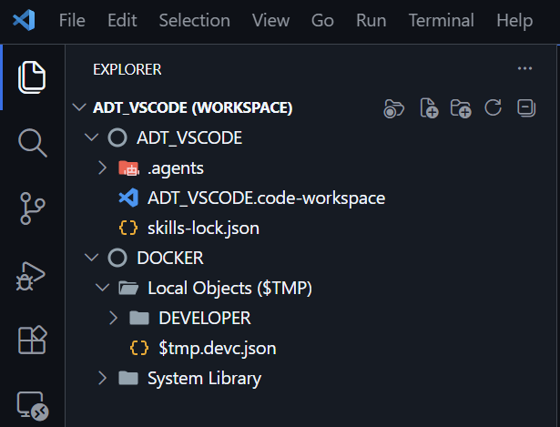

# SAP Skills

This is a skill repository for SAP Development. It contains general development skills, and ABAP related in first round.

Install all skills from this repository with the skills CLI:

```bash
npx skills add attilaberencsi/sapskills
```

List available skills without installing:

```bash
npx skills add attilaberencsi/sapskills --list
```

Install only the Clean ABAP skill:

```bash
npx skills add attilaberencsi/sapskills --skill clean-abap
```

Install only the Karpathy skill:

```bash
npx skills add attilaberencsi/sapskills --skill karpathy
```

This repository is structured as a multi-skill catalog so additional SAP- and ABAP-related skills can be added over time under `skills/`.

## Available Skills

- `clean-abap`: Apply Clean ABAP guidance when creating, refactoring, reviewing, or explaining ABAP artifacts. Origin:
- `karpathy`: Apply concise behavioral guardrails for coding agents: think before coding, keep solutions simple, make surgical changes, and verify against explicit success criteria.

## Hints for ABAPers

To be able work with SKILLS you need persistency to store them. ABAP filesytem provided by the VSCode extension is virtual. Therefore a multi-root workspace is needed. This way agents can recognioze the skills and work with them. Other aspect that instead of creating an ABAP restricted agent, full-stack develeopment including the UI5 and ABAP or CAP project is possible with the same agent aware of backend and frontend artefacts. 

1. Create a workspace folder on your local filesystem (ADT_VSCODE)
2. Open the folder in VSCode
3. install the skills as described above
4. Add SAP System as folder to the workspace (DOCKER)
5. Save the workspace file and open it next time instead of the package in VSCode (ADT_VSCODE.code-workspace)

As result both the local and virtual filesystem becomes part of your workspace.




## Origins

- `clean-abap` is derived from the `CleanABAP.md` guide [https://github.com/SAP/styleguides/blob/main/clean-abap/CleanABAP.md](https://github.com/SAP/styleguides/blob/main/clean-abap/CleanABAP.md)
- `karpathy` is adapted from the MIT-licensed `karpathy-guidelines` skill in the `multica-ai/andrej-karpathy-skills` repository.
- SAP Help Agent config added and adjusted as skill for Private Cloud Edition [https://help.sap.com/docs/abap-cloud/abap-development-tools-for-visual-studio-code/agent-configuration?locale=en-US&amp;version=LATEST](https://help.sap.com/docs/abap-cloud/abap-development-tools-for-visual-studio-code/agent-configuration?locale=en-US&version=LATEST)
